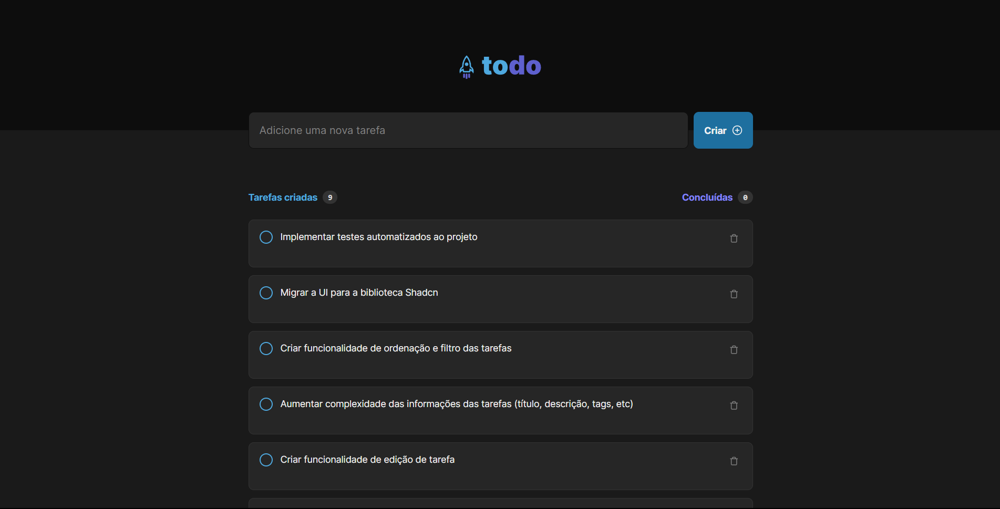

# Next To Do

This is a solution to the [FAQ accordion challenge on Frontend Mentor](https://www.frontendmentor.io/challenges/faq-accordion-wyfFdeBwBz). Frontend Mentor challenges help you improve your coding skills by building realistic projects. 

## Table of contents

- [Overview](#overview)
  - [The challenge](#the-challenge)
  - [Screenshot](#screenshot)
- [My process](#my-process)
  - [Built with](#built-with)
  - [What I learned](#what-i-learned)
  - [Useful resources](#useful-resources)
- [Author](#author)

## Overview

### The challenge

Users should be able to:

- Create/Delete the tasks and them in Browser local storage

### Screenshot

## My process

### Built with

- [React.js](https://vuejs.org/) - JS library
- [Tailwind CSS](https://tailwindcss.com/) - For styles
- [Radix UI](https://www.radix-vue.com/) - Unstyled, accessible components for building high‑quality web apps in Vue.
- [Sonner](https://www.radix-vue.com/) - Unstyled, accessible components for building high‑quality web apps in Vue.
- [Next.js](https://tailwindcss.com/) - For styles

### Useful resources

- [Radix UI](https://www.radix-ui.com/) - This is an amazing component library which helped me create accessible components. I'd recommend it to anyone still use this library.
- [Sooner](https://sonner.emilkowal.ski/) - This is an amazing component library which helped me create easy to customize toasts. I'd recommend it to anyone still use this library.

## Author

- GitHub - [@rodrigoqueiroz12](https://github.com/rodrigoqueiroz12)
- LinkedIn - [@rodrigoqueiroz](www.linkedin.com/in/rodrigo-queiroz-a113a9212)